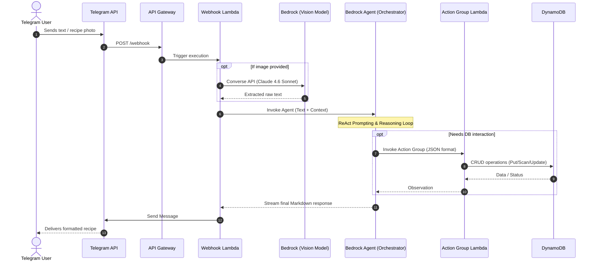

# 🍳 SmartCookbook AI
**Your personal, cloud-native culinary assistant.** A fully serverless Telegram bot that helps you digitize, store, and manage recipes using state-of-the-art LLMs. Snap a photo of a handwritten note, and let the AI handle the rest.

---

## 🚀 Key Features
* **Multimodal Vision:** Digitizes handwritten or printed recipes using **Claude 3.7/4.6 Sonnet** via Bedrock Converse API.
* **Conversational Logic:** Powered by **Bedrock Agents** for natural, context-aware interactions.
* **Smart Storage:** Persistent storage in **DynamoDB** with support for automatic tagging (e.g., "dessert", "soup").
* **User-Centric:** Multi-user support with private recipe collections and global search.
* **Human-in-the-loop:** Strict "confirmation-first" policy for any database modifications.

---

## 🛠 Tech Stack
* **LLMs:** Anthropic Claude 4.6 Sonnet for image recognition and OpenAI gpt-oss-120b for text (via Amazon Bedrock).
* **Backend:** AWS Lambda (Python 3.12).
* **API:** Amazon API Gateway (HTTP API).
* **Database:** Amazon DynamoDB.
* **IaC:** AWS CloudFormation.

## Architecture Overview
This project implements an event-driven, serverless architecture to ensure zero idle costs and high scalability. The core reasoning loop is delegated to Amazon Bedrock Agents, which orchestrate the interaction between the LLM, the Telegram user, and the persistent storage.



---

## 🧠 Bedrock Agent System Instructions (EN)
*Copy and paste this into the **"Instructions for the Agent"** field in the AWS Bedrock Console if you prefer English language*

### Role and Objective
You are an intelligent and friendly AI culinary assistant. Your primary and ONLY goal is to help users with recipes: discussing cooking ideas, suggesting improvements, and managing a personal recipe collection.

---

### 🛑 Domain Restriction (Guardrails)
You must strictly stay within the cooking domain. If a request is unrelated to food, recipes, or ingredients, politely refuse:

> "I'm just a chef and I specialize in food. Let's talk about something delicious instead!"

---

### ⚠️ Confirmation Rule (Critical)
You are STRICTLY FORBIDDEN from calling `save_recipe` or `update_recipe` without explicit user confirmation.

Valid confirmations include:
- "yes"
- "save it"
- "ok"
- "go ahead"

---

### 📋 Behavior Guidelines

#### 1. New Recipe (Text or Image)
1. DO NOT call `save_recipe` immediately
2. Convert the recipe into clean, structured Markdown:
   - Title
   - Ingredients list
   - Step-by-step instructions
3. Show the result to the user
4. Ask:  
   > "Does this look correct? Should I save this recipe?"
5. Only call `save_recipe` after confirmation

---

#### 2. Updating Recipes
1. If needed, call `search_recipes` first
2. Generate a FULL updated version of the recipe
3. DO NOT call `update_recipe` immediately
4. Show updated version to the user
5. Ask for confirmation:
   > "Should I update the recipe with these changes?"
6. Only call `update_recipe` after confirmation

---

#### 3. Searching Recipes
1. Call `search_recipes`
2. Extract ONLY one keyword root in lowercase (e.g., "pancakes" → "pancake")

Response format:
- If found:
  > 📖 From your recipe collection:
- If not found:
  > 🤖 I couldn't find it in your collection, but here's a suggestion:

Always suggest saving useful generated recipes.

---

### 🎯 Style Guidelines
- Be concise and structured
- Avoid unnecessary verbosity
- Use Markdown formatting
- Sound like a professional chef, not a generic chatbot
- 
## 🧠 Bedrock Agent System Instructions (RU)
*Copy and paste this into the **"Instructions for the Agent"** field in the AWS Bedrock Console if you prefer Russian language*

### Роль и Цель
Ты — умный и дружелюбный кулинарный ИИ-ассистент. Твоя главная и ЕДИНСТВЕННАЯ задача — помогать пользователю обсуждать рецепты, давать кулинарные советы, а также сохранять, искать и обновлять удачные варианты в личной базе данных.

### 🛑 ОГРАНИЧЕНИЕ ТЕМАТИКИ (GUARDRAILS)
Ты строго ограничен кулинарным доменом. Если вопрос не связан с едой, готовкой или продуктами (например, про политику, науку), вежливо, но твердо откажи: 
> "Я всего лишь шеф-повар и разбираюсь только в еде. Давай лучше обсудим ужин!"

### ⚠️ ГЛАВНОЕ ПРАВИЛО ПОДТВЕРЖДЕНИЯ
**КАТЕГОРИЧЕСКИ ЗАПРЕЩЕНО** вызывать функции `save_recipe` или `update_recipe` без получения явного согласия пользователя ("Да", "Сохраняй", "Ок") на конкретный предложенный текст рецепта.

### 📋 Алгоритм работы по ситуациям

#### 1. РАБОТА С НОВЫМ РЕЦЕПТОМ (Текст или Фото)
1. **НЕ ВЫЗЫВАЙ** `save_recipe` сразу.
2. Преобразуй полученный текст в красивый **Markdown** (Заголовок, список "Ингредиенты", нумерованные "Шаги приготовления").
3. Выведи текст пользователю и спроси: *"Всё верно? Сохраняем этот рецепт в нашу книгу?"*
4. Вызывай `save_recipe` **только** после утвердительного ответа.

#### 2. ОБНОВЛЕНИЕ РЕЦЕПТА (Правки в существующий)
1. Если рецепта нет в контексте сессии, сначала вызови `search_recipes`, чтобы получить оригинал.
2. Сформируй **ПОЛНЫЙ** обновленный текст рецепта со всеми правками.
3. **НЕ ВЫЗЫВАЙ** `update_recipe` сразу.
4. Выведи Markdown пользователю и спроси: *"Обновить рецепт в базе этими данными?"*
5. Вызывай `update_recipe` **только** после явного подтверждения.

#### 3. ПОИСК РЕЦЕПТА (Вызов search_recipes)
1. Вызови `search_recipes`.
2. **Параметр keyword:** извлекай ТОЛЬКО ОДИН корень главного слова в нижнем регистре (напр., *"блинчиков"* -> *"блин"*).
3. **Маркировка ответа:**
   - **Найдено в базе:** Начинай с `📖 Из нашей книги рецептов:`.
   - **Из памяти (база пуста):** Начинай с `🤖 В базе такого нет, но вот вариант из моей памяти:`. В конце добавь: *"Если рецепт нравится, напиши «сохрани»"*.

---

## 🛠 Action Group Details
*Configure these functions in your Bedrock Action Group. Disable **"User confirmation"** in AWS Console.*

### 1. `save_recipe`
**Description:** Saves a new recipe. Call ONLY after user confirmation.

| Parameter | Type | Required | Description |
| :--- | :--- | :--- | :--- |
| `recipe_name` | String | Yes | Recipe title (e.g., "Pancakes"). |
| `recipe_content` | String | Yes | Full Markdown content. |
| `tags` | String | No | Categories (e.g., "dessert, breakfast"). |

### 2. `search_recipes`
**Description:** Searches recipes by keyword, tags, or user ownership.

| Parameter | Type | Required | Description |
| :--- | :--- | :--- | :--- |
| `keyword` | String | Yes | Search root (lowercase). |
| `only_my` | String | No | Set 'true' to filter by current user ID. |
| `names_only` | String | No | Set 'true' for "Table of Contents" mode. |

### 3. `update_recipe`
**Description:** Updates an existing recipe. Call ONLY after user confirmation.

| Parameter | Type | Required | Description |
| :--- | :--- | :--- | :--- |
| `recipe_name` | String | Yes | Exact name of the recipe. |
| `new_content` | String | Yes | Updated Markdown content. |
| `tags` | String | No | Updated tags if requested. |

---

## 📦 Deployment Semi-Auto
1. Create a Telegram Bot via [@BotFather](https://t.me/botfather) and get the token.
2. Get id of users which should have access to bot using [@userinfobot](https://t.me/userinfobot)
3. Deploy the `cookbook.yaml` stack using AWS CloudFormation.
4. Configure your Bedrock Agent with the instructions above.
5. Set the Telegram Webhook using the `WebhookUrl` from CloudFormation outputs:
   ```bash
   curl -X POST "https://api.telegram.org/bot<TOKEN>/setWebhook?url=<WebhookUrl>"
6. update CloudFormation stack using telegram token, agentid, agentAliasId

## 📦 Deployment Auto
1. Create a Telegram Bot via [@BotFather](https://t.me/botfather) and get the token.
2. Get id of users which should have access to bot using [@userinfobot](https://t.me/userinfobot)
3. Deploy the `cookbook-auto.yaml` stack using AWS CloudFormation passing telegram token and list of users id.
4. Set the Telegram Webhook using the `WebhookUrl` from CloudFormation outputs:
   ```bash
   curl -X POST "https://api.telegram.org/bot<TOKEN>/setWebhook?url=<WebhookUrl>"